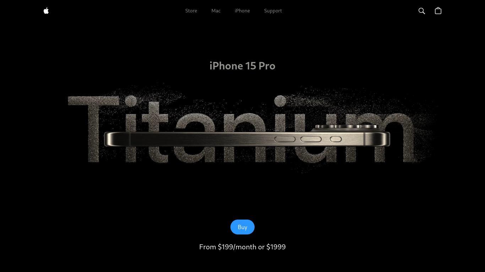

# Apple iPhone 15 — 3D Product Showcase


A fully-interactive **3D iPhone 15 product showcase** built with **React 19**, **Three.js via @react-three/fiber**, **TailwindCSS 4**, and **Vite 7**. Features immersive 3D models, video highlights, and smooth page animations.

---

## ✨ Overview

**Apple iPhone 15 Showcase** is a modern web portfolio to demonstrate Apple’s latest iPhone 15 in a highly interactive 3D environment. It provides users with an immersive product exploration experience using videos, 3D models, and animation effects.

You get:

- 📱 **Interactive 3D iPhone model** with lights and scene effects
- 🎥 **Video highlights** showing features and design
- 🖼️ Smooth animations and carousel highlights
- 🌐 Fully responsive UI for desktop and mobile
- ⚡ Ultra-fast performance with **Vite 7**

---

## 🖥️ Desktop Preview



---

## 📦 Tech Stack

### **Frontend**

- React 19
- Vite 7
- TailwindCSS 4
- React Router (if used)
- GSAP React for animations

### **3D & Animation**

- @react-three/fiber
- @react-three/drei
- GSAP
- Three.js 0.181

### **Developer Tools**

- ESLint 9
- Prettier 3 + Tailwind Prettier plugin
- SWC React plugin

---

## 🛠️ Getting Started

### 1. Clone the Repository

```bash
git clone https://github.com/grep-many/apple-iphone-15.git
cd apple-iphone-15
```

### 2. Install Dependencies

```bash
npm install
```

### 3. Start Development Server

```bash
npm run dev
```

### 4. Build for Production

```bash
npm run build
```

### 5. Preview Production Build

```bash
npm run preview
```

---

## 📁 Folder Structure

```bash
.
├── public                      # Favicons, manifest, icons
├── screenshots                  # Preview images
├── src
│   ├── assets
│   │   ├── images              # Product, icons, background images
│   │   ├── models              # 3D models (scene.glb)
│   │   └── videos              # Video highlights
│   ├── components              # Hero, Navbar, Features, Footer, VideoCarousel...
│   ├── constants               # Static data for highlights, features
│   ├── utils                    # Helper functions
│   ├── App.jsx
│   ├── index.css
│   └── main.jsx
├── package.json
├── vite.config.js
└── LICENSE
```

---

## 🚀 Features

- 🌐 **3D iPhone Experience** with lights and animations
- 🎬 **Video highlights & carousel**
- 💡 Animated features section using GSAP
- 📱 Fully responsive modern UI
- ⚡ Ultra-fast development and build with Vite

---

## 📜 Scripts

```json
{
  "dev": "vite",
  "build": "vite build",
  "lint": "eslint .",
  "preview": "vite preview"
}
```

---

## 🪪 License

[](./LICENSE)

This project is open-source under the **MIT License**.

---
